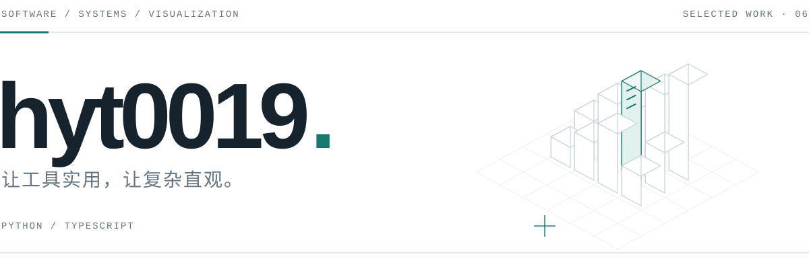

<picture>
  <source media="(prefers-color-scheme: dark) and (max-width: 600px)" srcset="./assets/identity.mobile.dark.svg">
  <source media="(max-width: 600px)" srcset="./assets/identity.mobile.light.svg">
  <source media="(prefers-color-scheme: dark)" srcset="./assets/identity.dark.svg">
  
</picture>

我用代码解决实际问题，也用可视化让信息更容易理解。项目涉及实用工具、自动化与企业应用，关注功能、体验，以及长期维护。

Python / TypeScript &nbsp; · &nbsp; 工具开发 / 三维可视化 / 业务系统

 

## 代码的另一种样子

CODE CITY &nbsp; / &nbsp; SIX PROJECTS, ONE SKYLINE

每个仓库是一片城区，每个文件是一栋建筑。六个项目，在这里组成一座城市。

<a href="https://hyt0019.github.io/code-city/">
  <picture>
    <source media="(prefers-color-scheme: dark)" srcset="https://hyt0019.github.io/code-city/assets/profile.dark.svg">
    
  </picture>
</a>

<a href="https://hyt0019.github.io/code-city/">进入城市 →</a>

 

## 公开作品

SELECTED PROJECTS &nbsp; / &nbsp; 01—04

### 01 &nbsp; [Code City](https://github.com/hyt0019/code-city)

把代码仓库转化为城市横幅与交互式 3D 场景，让项目规模与结构变得可见。支持多仓库展示、主题切换和自动更新。

TypeScript / React / Three.js &nbsp; · &nbsp; 代码可视化

### 02 &nbsp; [Container Load Planner](https://github.com/hyt0019/loader)

面向真实装载约束的三维装箱规划工具。将货物清单转化为可查看、可复核的装载方案，支持交互式预览与导入导出。

Python / Streamlit / Plotly &nbsp; · &nbsp; 优化与规划

### 03 &nbsp; [ReplayFlashFix](https://github.com/hyt0019/ReplayFlashFix)

检测并清除游戏录像中意外混入的桌面闪帧。提供 Windows 图形界面与批量处理，视频分析和修复均在本地完成。

Python / FFmpeg &nbsp; · &nbsp; 视频处理

### 04 &nbsp; [TJU Course Watcher](https://github.com/hyt0019/TJU-auto-course-selector)

基于 Python 标准库的选课辅助工具。支持满员重试、成功停止和登录失效提示，减少重复操作。

Python &nbsp; · &nbsp; 自动化工具

 

## 更多实践

PRIVATE PROJECTS &nbsp; / &nbsp; 05—06

### 05 &nbsp; 双语企业展示网站

面向企业介绍与产品展示的中英双语网站。支持语言切换、产品分类与结构化内容维护，将内容与页面代码分离，便于日常更新。

Astro / Docker &nbsp; · &nbsp; 私有项目

### 06 &nbsp; 外贸业务协同系统

串联采购、分批发货、报关与开票流程。将分散的表格和人工核对整合为可追溯的业务流程，支持数据导入导出、权限管理与操作审计，提供 Web 和桌面端。

React / TypeScript / PostgreSQL / Tauri &nbsp; · &nbsp; 私有项目

 

---

hyt0019 &nbsp; / &nbsp; 从实际需求出发，持续打磨工具。

